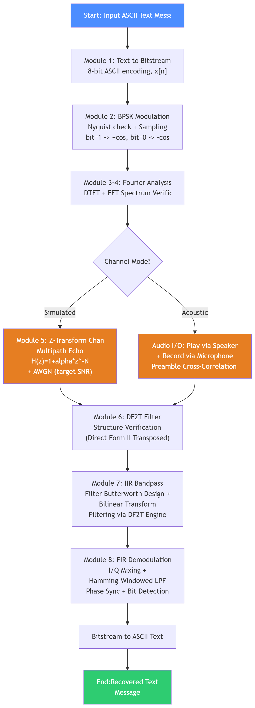
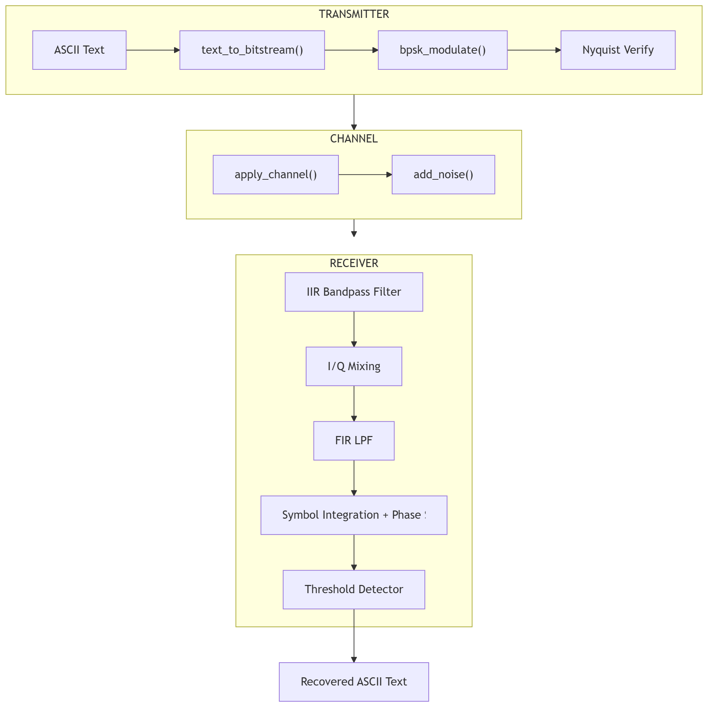

# Acoustic Spread-Spectrum Digital Transceiver

A complete software-defined acoustic modem built from first principles in Python. The system encodes text messages into Binary Phase Shift Keying (BPSK) waveforms, transmits them through an audio-frequency carrier, and recovers the original text on the receiving end using coherent demodulation. Every core signal processing block, including convolution, filtering, and demodulation, is implemented manually rather than relying on prebuilt library routines, so the entire chain from bits to sound and back is transparent and verifiable at each stage.

This project was developed as a mini project for the Digital Signal Processing course (COMP 407) at Kathmandu University, Department of Computer Science and Engineering.

## Overview

Digital modems sit at the intersection of several signal processing disciplines at once: signal representation, sampling, transformation, filtering, and equalization all occur within the same device. This project implements a full acoustic modem that uses only a computer's speaker and microphone as the physical channel. Because the carrier lives in the audible frequency range, every stage of the pipeline, from modulation to filtering to bit recovery, can be inspected and reasoned about directly.

The system was built around eight sequential DSP modules:

1. Discrete-time signal representation and classification
2. Sampling and continuous waveform synthesis
3. Fourier analysis using DTFT and FFT
4. Z-transform based channel modeling
5. Multipath and noise channel simulation
6. Direct Form II Transposed (DF2T) canonical filter structure
7. IIR filter design (Butterworth bandpass via the Bilinear Transform)
8. FIR filter design (window method) and coherent demodulation

## Key Features

- End-to-end text-to-audio-to-text transceiver pipeline built entirely in Python
- BPSK modulation on a 3 kHz carrier at a 44.1 kHz sampling rate
- Manually implemented convolution, verified against NumPy's built-in convolution
- Z-transform based channel model simulating multipath echo and additive white Gaussian noise (AWGN)
- Direct Form II Transposed filter engine implemented from its state-update equations, used as the shared filtering core for both IIR and FIR stages
- 4th order Butterworth bandpass filter (2000 Hz to 4000 Hz) designed via the Bilinear Transform
- 101-tap Hamming-windowed FIR low-pass filter for baseband recovery
- Coherent I/Q demodulation with automatic phase ambiguity correction
- Three distinct operating modes: pure simulation, real acoustic playback with known payload length, and a fully standalone receiver with blind bit-length detection
- Preamble generation and cross-correlation based timing synchronization for real acoustic transmission
- Interactive GUI built with CustomTkinter, including live console logging and inline result plots

## System Architecture

The diagram below shows the overall structure of the pipeline, from text input through modulation, channel, filtering, and demodulation, back to recovered text.



## Transmit and Receive Flow

The transmit path converts text into bits, modulates it onto the carrier, and confirms the resulting spectrum. The receive path filters the incoming signal, demodulates it coherently, corrects for phase ambiguity, and applies threshold detection to recover the bits.



## Theoretical Background

The project is grounded in a set of core DSP concepts, each implemented and experimentally verified rather than assumed:

- **Discrete-time signals**: an ASCII message is expanded into an 8-bit-per-character sequence and classified as an energy signal due to its finite length.
- **Discrete convolution**: the convolution sum is implemented with an explicit nested loop and cross-checked against NumPy for correctness.
- **Nyquist-Shannon sampling theorem**: the carrier frequency of 3 kHz is chosen well below the Nyquist limit of 22.05 kHz given a 44.1 kHz sampling rate, leaving substantial headroom against aliasing.
- **Binary Phase Shift Keying**: bits are mapped to a 180 degree phase shift of the carrier, with binary 1 represented as a positive cosine and binary 0 as its negation.
- **Fourier analysis**: both the Discrete-Time Fourier Transform and the Fast Fourier Transform are computed and compared to confirm that the modulated signal's energy is concentrated around the carrier frequency.
- **Z-transform and stability**: the multipath channel is modeled as a feed-forward system with all poles at the origin, guaranteeing bounded-input bounded-output stability.
- **Direct Form II Transposed structure**: a canonical, minimal-delay filter realization implemented and validated against a manually solved difference equation.
- **IIR filter design**: a Butterworth bandpass filter is designed using the Bilinear Transform to isolate the carrier band and reject channel noise.
- **FIR filter design**: a low-pass filter is designed using the window method with a Hamming window to remove the double-frequency component after mixing down to baseband.
- **Coherent demodulation**: in-phase and quadrature mixing, combined with a phase ambiguity correction step, allow reliable bit detection even when the channel introduces an unknown phase offset.

## Operating Modes

The pipeline supports three distinct ways of routing the signal between transmitter and receiver. The transmitter and receiver code paths themselves are identical across all three; only the channel differs.

| Mode | Description |
|---|---|
| A: Simulated Channel | The transmit waveform is passed directly through a software Z-transform channel model with multipath echo and AWGN. Fully repeatable and used as the theoretical baseline. |
| B: Acoustic, Record Only | The waveform is played from an external device while the computer records the real over-the-air audio. Preamble cross-correlation synchronizes the recording before demodulation. The payload length is known in advance. |
| C: Standalone Receiver | Identical audio path to Mode B, but the receiver program runs independently with no knowledge of the true payload length, only a fixed recording window. It must locate the preamble and infer how many bits follow purely from the recorded samples. |

## Parameters Used

| Parameter | Symbol | Value |
|---|---|---|
| Sampling rate | Fs | 44,100 Hz |
| Carrier frequency | Fc | 3,000 Hz |
| Symbol duration | Tsym | 10 ms (100 bits per second) |
| Samples per bit | - | 441 samples |
| Echo delay | N | 50 samples |
| Echo attenuation | alpha | 0.5 |
| Target channel SNR | - | 15 dB |
| IIR filter type and order | - | Butterworth bandpass, order 4 |
| IIR passband | - | 2,000 Hz to 4,000 Hz |
| FIR filter taps and window | - | 101 taps, Hamming window |
| FIR cutoff frequency | - | 200 Hz |

## Technology Stack

| Component | Library or Tool | Purpose |
|---|---|---|
| Core computation | NumPy | Array operations, FFT, general numerical processing |
| Filter design (limited use) | SciPy (`signal.butter`, `signal.freqz`) | Butterworth coefficient generation and frequency response evaluation only |
| Plotting | Matplotlib | All spectral, time-domain, and Z-plane visualizations |
| Audio input and output | SoundDevice | Real-time playback and microphone recording |
| User interface | CustomTkinter | Interactive GUI with console logging and inline plots |
| Core DSP algorithms | Custom Python loops | Convolution, DF2T filtering, and FIR filtering, implemented without `scipy.signal.lfilter` or `scipy.signal.convolve` |

## Results

The system was tested with the message "Hello this is our DSP Mini Project" (272 bits, 34 characters) across all three modes.

| Mode | Channel | Filtered Signal Max Amplitude | Measured SNR | Recovered Text |
|---|---|---|---|---|
| A, Simulated | Software model (echo and AWGN) | 1.7147 | 15.0 dB (target 15.0 dB) | Hello this is our DSP Mini Project |
| B, Acoustic Record Only | Real air, phone speaker to PC microphone | 0.1803 | Sharp correlation peak detected | Hello this is our DSP Mini Project |
| C, Standalone Receiver | Real air, phone speaker to PC microphone | 0.1258 | Weaker correlation peak, 45 characters auto-detected (actual 34) | First 27 characters correct, followed by garbled output |

Modes A and B recovered the message with zero bit errors. Mode C correctly decoded the first 27 of 34 characters before continuing to demodulate room echo and ambient noise as if they were additional payload bits, since the standalone receiver has no length header or end-of-message marker and simply treats every sample in its fixed recording window as data. This is a protocol-level limitation rather than a filtering or demodulation failure, and it demonstrates why a practical system needs an explicit indication of payload length or an energy-based end-of-transmission detector.

## Repository Structure

```
.
├── assets/
│   ├── system.png                  System level flowchart
│   └── transmit_receive.png        Transmit and receive flowchart
├── main.py                         TransceiverPipeline entry point, orchestrates all modules
├── config.py                       Global configuration for sample rate, carrier, filters, and channel parameters
├── ui.py                           CustomTkinter based GUI wrapper
├── module_audio_io.py              Real-time audio playback and recording, preamble sync
├── module_5_ztransform.py          Z-transform based channel simulation (multipath and AWGN)
└── ...                             Remaining DSP modules (signal init, modulation, filtering, demodulation)
```

## Getting Started

### Prerequisites

- Python 3.9 or later
- A working microphone and speaker (required for Modes B and C)

### Installation

```bash
git clone https://github.com/Hridayanshu-Sumira/acoustic-spread-spectrum-digital-transceiver
cd acoustic-spread-spectrum-digital-transceiver
pip install -r requirements.txt
```

### Running the System

Launch the interactive GUI:

```bash
python ui.py
```

Or run the pipeline directly from the command line, selecting one of the three operating modes described above. Refer to `main.py` and `config.py` for the available entry points and tunable parameters.

## Limitations and Future Work

The standalone receiver mode (Mode C) currently has no mechanism to signal the true payload length, which leads to over-detection once the genuine message ends. Planned extensions include:

- Adding explicit length indicators or end-of-message markers to the transmitted frame
- Increasing bit rate through higher-order modulation schemes such as QPSK or QAM
- Implementing adaptive equalization to handle time-varying multipath conditions
- Adding forward error correction, such as Hamming codes or convolutional coding
- Detecting the end of transmission through energy-based detection rather than a fixed recording window

## References

1. J. G. Proakis and D. K. Manolakis, Digital Signal Processing, Prentice-Hall, 1992.
2. A. V. Oppenheim and R. W. Schafer, Digital Signal Processing, 1975.
3. S. Haykin and M. Moher, Communication Systems, John Wiley and Sons, 2009.
4. B. Sklar and F. Harris, Digital Communications: Fundamentals and Applications, 3rd edition, 2020.
5. SciPy community, scipy.signal documentation, https://docs.scipy.org/doc/scipy/reference/signal.html
6. NumPy developers, numpy.fft documentation, https://numpy.org/doc/stable/reference/routines.fft.html
7. Matplotlib development team, https://matplotlib.org
8. M. Geier, python-sounddevice documentation, https://python-sounddevice.readthedocs.io

## Authors

- Hridayanshu Raj Acharya
- Sumira Makaju

Department of Computer Science and Engineering, Kathmandu University

Submitted to Mr. Rupesh Dahi Shrestha, Department of Electrical and Electronics Engineering

## Demo

A demonstration video of the working system is available [here](https://drive.google.com/file/d/1o9fjdfej3gFNuSzxiURPE8MmbIjc6izm/view?usp=drive_link).

## License

This project was developed for academic purposes as part of the Digital Signal Processing course at Kathmandu University. Please reach out to the authors before reusing substantial portions of the code or report.
